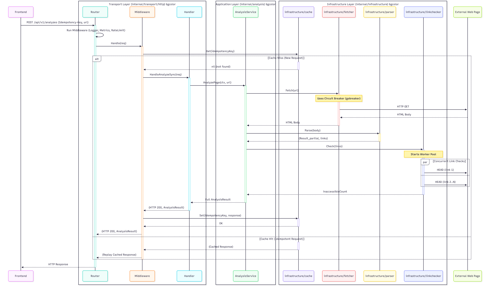

# Web Page Analyzer Service

A high-performance web page analyzer to analyze and provides a detailed breakdown as per following.

It analyzes a web page URL and returns:
* HTML version
* Page title
* Heading counts (h1–h6)
* Internal, external, and inaccessible link counts
* Whether a login form is present (Assumption : Login form can exist without form attribute also)

## ✨ Features

* **Dual API Endpoints**: Synchronous (`/api/v1/analyzes`) for immediate results and Asynchronous (`/api/v1/analyzes/async`) for "fire-and-forget" requests.
* **Modern Architecture**: Built using Clean Architecture to decouple business logic from infrastructure.
* **Robust & Resilient**: Uses a Circuit Breaker for fetching and a concurrent Worker Pool for fast, safe link checking.
* **Production-Ready**: Includes authentication (JWT), rate limiting, and idempotency.
* **Fully Observable**: Exposes structured `slog` logs, Prometheus metrics (`/metrics`), and `pprof` profiling (`/debug`).
* **Configurable**: All settings are managed externally via a `config.properties` file (viper).

## 🛠️ Tech Stack

* **Framework**: `chi` (v5) for lightweight, high-performance routing.
* **Configuration**: `viper`
* **Logging**: `slog` (structured JSON logging)
* **Concurrency**: Goroutines, Channels, and WaitGroups (CSP)
* **Authentication**: `golang-jwt/jwt` (v5)
* **Resiliency**: `sony/gobreaker` (Circuit Breaker)
* **Observability**: `prometheus/client_golang`

## 🔄 System Flow

This diagram shows the sequence flow for handling an analysis request through the system's different architectural layers.

<p align="center">
  
</p>

## 🚀 Getting Started

### Prerequisites

* Go (version 1.24 or higher)
* Make (optional, for convenience)
* Docker (optional, for containerized running)

### 1. Configuration

The application is configured using the `config.properties` file. Before running, you must create this file in the root of the project.

2. How to Run
Option A: Run Locally (with make)

This is the easiest way to run the application for development.

```bash
# 1. Install dependencies
make tidy

# 2. Run the server
make run
```

Option B: Run Locally
```bash
# 1. Install dependencies
go mod tidy

# 2. Run the server
go run ./cmd/server/main.go
```

Option C: Run with Docker (Production-Style)
This builds the multi-stage Dockerfile and runs the production-ready container.

```bash
# 1. Build the Docker image
make docker-build

# 2. Run the container
make docker-run
```

The server is now running on http://localhost:8080.

📡 API Endpoints
All /api/v1 routes are protected by JWT authentication.

Authentication
First, set this valid JWT in your shell environment. This token is signed with the default jwt.secret from your config.properties.


1. Synchronous Analysis
This endpoint sends a request, waits for the full analysis, and returns the JSON result.

Endpoint: POST /api/v1/analyzes

This endpoint supports idempotency to allow you to safely retry requests without risking duplicate operations. 

To use this feature, the client must provide a unique Idempotency-Key in the HTTP header for each new analysis request.

Request

Note : As mentioned in the above, use the unique Idempotency-Key
```bash
curl -X POST http://localhost:8080/api/v1/analyzes -H "Content-Type: application/json" -H "Idempotency-Key: 1234567" -d "{\"requestId\":\"demo-sync-1\",\"email\":\"test@example.com\",\"url\":\"https://uom.lk\"}"
```

Success Response (200 OK):
```json
{
    "html_version": "HTML 5",
    "title": "HTML 5 Test Page",
    "headings": {
        "h1": 1,
        "h2": 1,
        "h3": 1,
        "h4": 1,
        "h5": 1,
        "h6": 1
    },
    "links": {
        "internal": 1,
        "external": 0,
        "inaccessible": 0
    },
    "has_login_form": false
}
```

2. Asynchronous Analysis
This endpoint sends a request and immediately receives a 202 Accepted response. The analysis is processed in the background (visible in server logs).

Endpoint: POST /api/v1/analyzes/async

This endpoint supports idempotency to allow you to safely retry requests without risking duplicate operations. 

To use this feature, the client must provide a unique Idempotency-Key in the HTTP header for each new analysis request.

Request

Note : As mentioned in the above, use the unique Idempotency-Key
```bash
curl -X POST http://localhost:8080/api/v1/analyzes/async -H "Content-Type: application/json" -H "Idempotency-Key: 1234567" -d "{\"requestId\":\"demo-sync-1\",\"email\":\"test@example.com\",\"url\":\"https://uom.lk\"}"
```

Success Response (202 Accepted):
JSON
```json
{
    "message": "Analysis request accepted and is being processed.",
    "requestId": "demo-async-1"
}
```

Note : Purpose of this API is to perfom analysis asynchronously and send the results to the client email. This API completion is next stage task, right now accepting the requests only.


4. Health & Observability
This API is used to monitor the health status of the application.

Health Check: GET /health

```bash

curl http://localhost:8080/health
# {"status":"ok"}
```
Prometheus Metrics: GET /metrics

```bash
curl http://localhost:8080/metrics
```

Go Profiling (pprof):
```bash
http://localhost:8080/debug/pprof/ (index)

http://localhost:8080/debug/pprof/goroutine?debug=1 (all goroutines)
```

3. Test coverage

Execute either 1 or 2
```code

1. <<webpage-analyzer-service-directory>>> make coverage or
2. <<webpage-analyzer-service-directory>>> go test ./... -coverprofile=coverage.out
 
"Running tests and generating coverage report..."
        webpage-analyzer-service/cmd/server             coverage: 0.0% of statements
ok      webpage-analyzer-service/internal/analysis      0.786s  coverage: 93.5% of statements
ok      webpage-analyzer-service/internal/auth  0.929s  coverage: 93.5% of statements
ok      webpage-analyzer-service/internal/config        0.850s  coverage: 92.6% of statements
        webpage-analyzer-service/internal/constants             coverage: 0.0% of statements
        webpage-analyzer-service/internal/domain                coverage: 0.0% of statements
ok      webpage-analyzer-service/internal/infrastructure/cache  0.949s  coverage: 100.0% of statements
ok      webpage-analyzer-service/internal/infrastructure/fetcher        0.527s  coverage: 93.8% of statements
ok      webpage-analyzer-service/internal/infrastructure/linkchecker    0.522s  coverage: 94.9% of statements
        webpage-analyzer-service/internal/infrastructure/logging                coverage: 0.0% of statements
ok      webpage-analyzer-service/internal/infrastructure/parser 0.612s  coverage: 98.7% of statements
        webpage-analyzer-service/internal/infrastructure/queue          coverage: 0.0% of statements
ok      webpage-analyzer-service/internal/infrastructure/validation     0.540s  coverage: 91.7% of statements
ok      webpage-analyzer-service/internal/transport/http        0.600s  coverage: 91.0% of statements
ok      webpage-analyzer-service/internal/transport/http/middleware     0.604s  coverage: 69.0% of statements

```